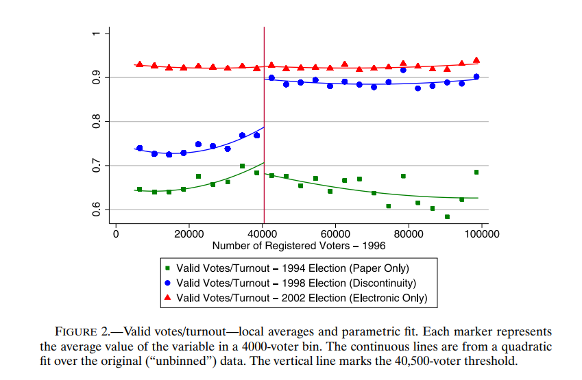
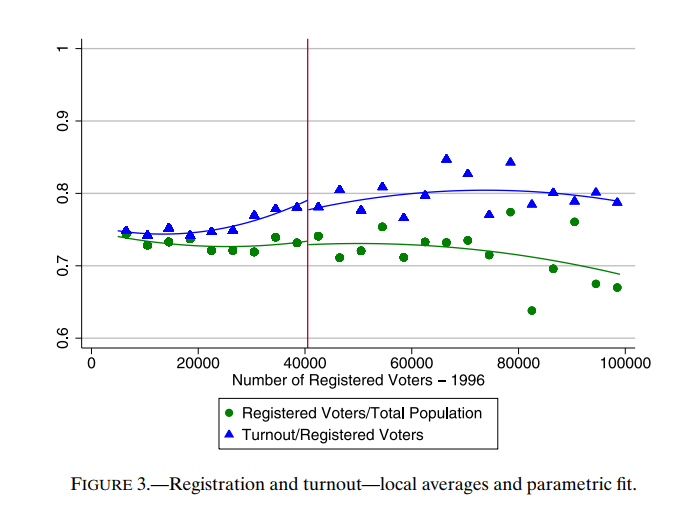

```{r setup, include=FALSE}
knitr::opts_chunk$set(echo = TRUE)
```

## 1 - Introduction {.tabset}

### Motivation

-   Focusing on improvements in participation within a context where universal suffrage is already established.

### Goals

-   Show how improving the political participation of less educated (poorer) voters can advance policies targeting them.

-   Estimate the effects of an electronic voting (EV) technology in increasing political participation and in the enfranchisement of less educated voters.

-   Evaluate if this enfranchisement of the less educated citizenry did indeed affect policy in a manner consistent with political economy theories of redistribution.

-   Increase in the share of left-wing state legislators, increased public health care spending, utilization (prenatal visits), and an improvement in infant health markers (birthweight).

### Institutional Background

## 2 - Empirical Strategy

### Bird's eye view

-   The paper exploits a regression discontinuity design (RDD) embedded in EV’s introduction.

-   In the 1998 election, only municipalities with more than 40,500 registered voters used the new technology, while the rest used paper ballots.

-   Only 58% of adults (aged 25+) completed 4th grade. Figures are from the 1991 Census (the last one prior to the introduction of electronic voting) the hypothesis that these voters were more likely to be less educated, the effects are larger in municipalities with higher illiteracy rates. Moreover, EV raises the vote shares of left-wing parties. These results are not driven by the (non-existent) effects on turnout or candidate entry (given the at-large nature of state elections).

Since the discontinuous assignment was observed in an election for state officials, I focus on state government spending, in particular on an area that disproportionately affects the less educated: health care. Poorer Brazilians rely mostly on a public-funded system for health care services, while richer voters are more likely to use private services (Alves and Timmins (2003)). The less educated have thus relatively stronger preferences for public health services, and a shift in spending toward health care can be interpreted as redistribution to the poor.4 Consistent with this interpretation, I also find that EV raised the number of prenatal visits by health professionals and lowered the prevalence of low-weight births (below 2500 g) by less educated women, but not for the more educated.5 The state-level results exploit the fact that the discontinuous assignment in the 1998 election created specific and unusual differences in the timing of exposure across states. The phase-in of the new technology was carried out over three consecutive elections held in 1994, 1998, and 2002. In 1994, only paper ballots were used. In 1998, there was the discontinuous assignment described above. In 2002, only EV was used. Such a schedule implies that the evolution of EV in a state is entirely determined by a time-invariant cross-sectional variable: the share of voters living in municipalities above the cutoff for its use in 1998. If a state has S% of its voters living above cutoff, S% of its voters changed from using paper to EV technology between the 1994 and 1998 elections. Moreover, between the 1998 and 2002 elections, the remaining (1−S)% of voters switched to EV. Hence, states with higher shares of voters above the 40,500-voter threshold experienced most of the enfranchising effects of EV earlier than the states with a low share. Intuitively, the empirical strategy tests if outcomes of interest track this same pattern. The effects of EV on policy outcomes are thus identified only from variation coming from the interaction of a cross-sectional variable (share of voters above the cutoff) with the timing of elections. In the period (1994–1998) when 4Health care is also a very salient issue for voters and politicians, as discussed in Section 3.1. 5Other than its importance for welfare and the growing evidence on the adult-life consequences of early-life health (Almond and Currie (2011), Currie and Vogl (2013)), the focus on birth outcomes is also motivated by issues of data availability and that newborn health can respond rapidly to health care improvements, which is important for an empirical strategy based on the sharp timing of EV roll-out.426 THOMAS FUJIWARA such a variable positively predicts EV use, it also positively predicts valid voting, health care spending, number of prenatal visits, and birthweight. On the other hand, in the period (1998–2002) when the same cross-sectional variable negatively predicts EV use, it negatively predicts these outcomes. Such results are interpreted as evidence of a causal effect of EV since this sharp change in the sign of how the same cross-sectional variable predicts growth in outcomes is unlikely to be driven by omitted variables. In other words, any confounding effect would have to follow a very specific pattern to confound the results. More precisely, an omitted variable or mean-reversing shock that (positively) affects health care spending would need to (i) be growing faster in states with higher share of voters above the cutoff, and (ii) change to growing slower in such states with a timing matching election dates. Four sets of additional tests provide evidence against these possible confounding effects. First, the timing of effects occurs quickly after elections, implying that possible omitted shocks (and their mean reversion) must follow quite specific timing. Second, the share of voters above the cutoff is orthogonal to changes in outcomes in periods when it is not associated with changes in voting technology, addressing the issue of preexisting trends. Third, I find negligible (placebo) effects on variables not expected to be affected by EV, such as general economic conditions and birth outcomes for more educated mothers, as well as spending by municipal governments, which were exposed to EV under different timing but should also respond to shocks to health care demand. Fourth, the results are robust to controlling for (nonlinear) time trends interacted with state characteristics, as well as an instrumental variable strategy that focuses on the distribution of municipalities closer to the cutoff. The estimates indicate that the de facto enfranchisement of approximately a tenth of Brazilian voters increased the share of states’ budgets spent on health care by 3.4 percentage points (p.p.), raising expenditure by 34% in an eightyear period. It also boosted the proportion of uneducated mothers with more than seven prenatal visits by 7 p.p. and lowered the prevalence of low-weight births by 0.5 p.p. (respectively, a 19% and −6:8% change over sample averages).

### Details

## 3 - Results {.tabset}

### Figures {.tabset}

#### Figure 2



#### Figure 3



### Tables {.tabset}

#### Table 1

## 4 - Conclusion
