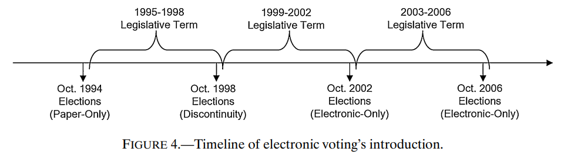

## Step 1: Importing needed packages

```{r}
pacman::p_load("tidyverse",
               "estimatr",
               "stats",
               "fixest",
               "rdrobust",
               "rddensity",
               "robust",
               "rdd",
               "miceadds",
               "rddtools",
               "here",
               "cowplot",
               "scales",
               "stargazer",
               "foreign",
               "sf",
               "geobr",
               "RColorBrewer",
               "stringi",
               "stringr",
               "haven",
               "broom",
               "simpleboot")
```

## Step 2: Loading databases

```{r}
df_mun = read.dta(here("replication_project/data", "munic.dta"))
df_state = read.dta(here("replication_project/data", "state.dta"))
df_yearly = read.dta(here("replication_project/data", "yearly.dta"))
```

## Step 3: Cleaning databases

```{r}
# Define variables
munic = df_mun %>%
  mutate(
    dep = voters96 - 40500,
    treat = ifelse(dep > 0, 1, 0),
    deptreat = dep * treat,
    bw = ifelse(dep < 0, -dep, dep),
    ones = 1
  )

# Set binned variables
bins = seq(500, 200000, by = 4000)
munic = munic %>%
  mutate(bin_voters96 = cut(voters96, breaks = bins, right = FALSE, labels = FALSE) * 4000 + 2000) %>%
  group_by(bin_voters96) %>%
  mutate(
    bin_util94 = mean(r_util94, na.rm = TRUE),
    bin_util98 = mean(r_util98, na.rm = TRUE),
    bin_util02 = mean(r_util02, na.rm = TRUE),
    bin_attend = mean(attend, na.rm = TRUE),
    bin_regist = mean(regist, na.rm = TRUE),
    bin_obs = sum(ones)
  ) %>%
  ungroup()
```

## Step 4: Generating tables
# Table I
```{r}
# Define variables and bandwidths
covars = c("income", "gini", "latitude", "longitude", "illiter", "less4", "less8", "population91", "population00", "urbanization")
ikbw = c(20000, 15596, 16547, 14531, 16068, 15415, 20000, 20000, 17668, 20000)
obs = c(558, 377, 412, 345, 389, 372, 558, 558, 454, 558)
ikbw_df = data.frame(covars, ikbw, obs)

# Initialize lists to store coefficients and robust standard errors
coef_list = list()
se_list = list()
intercept_list = list()
intercept_se_list = list()

# Calculate means and standard deviations for each variable
mean_sd_list = list()

# Loop through each variable and estimate models with three bandwidths
for (i in 1:nrow(ikbw_df)) {
  var = ikbw_df$covars[i]
  
  # Regression with IK optimal bandwidth
  model1 = lm(as.formula(paste(var, "~ treat + dep + deptreat")), data = subset(munic, bw < ikbw_df$ikbw[i]))
  robust1 = coeftest(model1, vcov = vcovHC(model1, type = "HC1"))
  coef_list[[paste0(var, "_bw1")]] = robust1["treat", "Estimate"]
  se_list[[paste0(var, "_bw1")]] = robust1["treat", "Std. Error"]
  intercept_list[[paste0(var, "_bw1")]] = robust1["(Intercept)", "Estimate"]
  intercept_se_list[[paste0(var, "_bw1")]] = robust1["(Intercept)", "Std. Error"]
  
  # Regression with bandwidth < 10000
  model2 = lm(as.formula(paste(var, "~ treat + dep + deptreat")), data = subset(munic, bw < 10000))
  robust2 = coeftest(model2, vcov = vcovHC(model2, type = "HC1"))
  coef_list[[paste0(var, "_bw2")]] = robust2["treat", "Estimate"]
  se_list[[paste0(var, "_bw2")]] = robust2["treat", "Std. Error"]
  
  # Regression with bandwidth < 5000
  model3 = lm(as.formula(paste(var, "~ treat + dep + deptreat")), data = subset(munic, bw < 5000))
  robust3 = coeftest(model3, vcov = vcovHC(model3, type = "HC1"))
  coef_list[[paste0(var, "_bw3")]] = robust3["treat", "Estimate"]
  se_list[[paste0(var, "_bw3")]] = robust3["treat", "Std. Error"]
  
  # Calculate mean and standard deviation for the variable
  mean_val = mean(munic[[var]], na.rm = TRUE)
  sd_val = sd(munic[[var]], na.rm = TRUE)
  mean_sd_list[[var]] = c(mean_val, sd_val)
}

# Create a matrix to display in stargazer
output_table = matrix("", nrow = length(covars) * 2 + 2, ncol = 7)

# Fill the first column with variable names, "bandwidth", and "obs"
output_table[seq(1, length(covars) * 2, 2), 1] = covars
output_table[length(covars) * 2 + 1, 1] = "bandwidth"
output_table[length(covars) * 2 + 2, 1] = "obs"

# Fill the remaining columns with coefficients, robust standard errors, means, standard deviations, bandwidths, and observations
for (j in 1:length(covars)) {
  var = covars[j]
  
  # Fill coefficients and robust standard errors for each specification
  output_table[2 * j - 1, 3] = sprintf("%.3f", intercept_list[[paste0(var, "_bw1")]])
  output_table[2 * j, 3] = sprintf("(%.3f)", intercept_se_list[[paste0(var, "_bw1")]])
  
  output_table[2 * j - 1, 5] = sprintf("%.3f", coef_list[[paste0(var, "_bw1")]])
  output_table[2 * j, 5] = sprintf("(%.3f)", se_list[[paste0(var, "_bw1")]])
  
  output_table[2 * j - 1, 6] = sprintf("%.3f", coef_list[[paste0(var, "_bw2")]])
  output_table[2 * j, 6] = sprintf("(%.3f)", se_list[[paste0(var, "_bw2")]])
  
  output_table[2 * j - 1, 7] = sprintf("%.3f", coef_list[[paste0(var, "_bw3")]])
  output_table[2 * j, 7] = sprintf("(%.3f)", se_list[[paste0(var, "_bw3")]])
  
  # Fill mean and standard deviation
  output_table[2 * j - 1, 2] = sprintf("%.3f", mean_sd_list[[var]][1])
  output_table[2 * j, 2] = sprintf("(%.3f)", mean_sd_list[[var]][2])
  
  # Fill ikbw and obs
  output_table[2 * j - 1, 4] = ikbw_df$ikbw[j]
  output_table[2 * j, 4] = ikbw_df$obs[j]
}

# Add bandwidth and observations to the last two rows
output_table[length(covars) * 2 + 1, 2:7] = c("—", "—", "—", "IKBW", "10000", "5000")
output_table[length(covars) * 2 + 2, 2:7] = c("5281", "—", "—", "—", "229", "116")

# Convert the matrix to a data frame and set column names
output_df = as.data.frame(output_table)
colnames(output_df) = c("", "Mean (SD)", "Pre-Treat. (SE)", "IKBW (Obs)", "(1)", "(2)", "(3)")

# Display the table with stargazer
stargazer(
  output_df,
  type = "text",
  summary = FALSE,
  title = "Table I",
  rownames = FALSE
)
```

# Table II - Panels A & B
```{r}
# Define variables and bandwidths
vars = c("r_util98", "attend", "regist", "r_util94", "r_util02")
ikbw = c(11873, 12438, 15956, 17111, 17204)
obs = c(265, 283, 388, 433, 437)
ikbw_df = data.frame(vars, ikbw, obs)

# Initialize lists to store coefficients and robust standard errors
coef_list = list()
se_list = list()
intercept_list = list()
intercept_se_list = list()

# Calculate means and standard deviations for each variable
mean_sd_list = list()

# Loop through each variable and estimate models with three bandwidths
for (i in 1:nrow(ikbw_df)) {
  var = ikbw_df$vars[i]
  
  # Regression with IK optimal bandwidth
  model1 = lm(as.formula(paste(var, "~ treat + dep + deptreat")), data = subset(munic, bw < ikbw_df$ikbw[i]))
  robust1 = coeftest(model1, vcov = vcovHC(model1, type = "HC1"))
  coef_list[[paste0(var, "_bw1")]] = robust1["treat", "Estimate"]
  se_list[[paste0(var, "_bw1")]] = robust1["treat", "Std. Error"]
  intercept_list[[paste0(var, "_bw1")]] = robust1["(Intercept)", "Estimate"]
  intercept_se_list[[paste0(var, "_bw1")]] = robust1["(Intercept)", "Std. Error"]
  
  # Regression with bandwidth < 10000
  model2 = lm(as.formula(paste(var, "~ treat + dep + deptreat")), data = subset(munic, bw < 10000))
  robust2 = coeftest(model2, vcov = vcovHC(model2, type = "HC1"))
  coef_list[[paste0(var, "_bw2")]] = robust2["treat", "Estimate"]
  se_list[[paste0(var, "_bw2")]] = robust2["treat", "Std. Error"]
  
  # Regression with bandwidth < 5000
  model3 = lm(as.formula(paste(var, "~ treat + dep + deptreat")), data = subset(munic, bw < 5000))
  robust3 = coeftest(model3, vcov = vcovHC(model3, type = "HC1"))
  coef_list[[paste0(var, "_bw3")]] = robust3["treat", "Estimate"]
  se_list[[paste0(var, "_bw3")]] = robust3["treat", "Std. Error"]
  
  # Calculate mean and standard deviation for the variable
  mean_val = mean(munic[[var]], na.rm = TRUE)
  sd_val = sd(munic[[var]], na.rm = TRUE)
  mean_sd_list[[var]] = c(mean_val, sd_val)
}

# Create a matrix to display in stargazer
output_table = matrix("", nrow = length(vars) * 2 + 2, ncol = 7)

# Fill the first column with variable names, "bandwidth", and "obs"
output_table[seq(1, length(vars) * 2, 2), 1] = vars
output_table[length(vars) * 2 + 1, 1] = "bandwidth"
output_table[length(vars) * 2 + 2, 1] = "obs"

# Fill the remaining columns with coefficients, robust standard errors, means, standard deviations, bandwidths, and observations
for (j in 1:length(vars)) {
  var = vars[j]
  
  # Fill coefficients and robust standard errors for each specification
  output_table[2 * j - 1, 3] = sprintf("%.3f", intercept_list[[paste0(var, "_bw1")]])
  output_table[2 * j, 3] = sprintf("(%.3f)", intercept_se_list[[paste0(var, "_bw1")]])
  
  output_table[2 * j - 1, 5] = sprintf("%.3f", coef_list[[paste0(var, "_bw1")]])
  output_table[2 * j, 5] = sprintf("(%.3f)", se_list[[paste0(var, "_bw1")]])
  
  output_table[2 * j - 1, 6] = sprintf("%.3f", coef_list[[paste0(var, "_bw2")]])
  output_table[2 * j, 6] = sprintf("(%.3f)", se_list[[paste0(var, "_bw2")]])
  
  output_table[2 * j - 1, 7] = sprintf("%.3f", coef_list[[paste0(var, "_bw3")]])
  output_table[2 * j, 7] = sprintf("(%.3f)", se_list[[paste0(var, "_bw3")]])
  
  # Fill mean and standard deviation
  output_table[2 * j - 1, 2] = sprintf("%.3f", mean_sd_list[[var]][1])
  output_table[2 * j, 2] = sprintf("(%.3f)", mean_sd_list[[var]][2])
  
  # Fill ikbw and obs
  output_table[2 * j - 1, 4] = ikbw_df$ikbw[j]
  output_table[2 * j, 4] = ikbw_df$obs[j]
}

# Add bandwidth and observations to the last two rows
output_table[length(vars) * 2 + 1, 2:7] = c("—", "—", "—", "IKBW", "10000", "5000")
output_table[length(vars) * 2 + 2, 2:7] = c("5281", "—", "—", "—", "229", "116")

# Convert the matrix to a data frame and set column names
output_df = as.data.frame(output_table)
colnames(output_df) = c("", "Mean (SD)", "Pre-Treat. (SE)", "IKBW (Obs)", "(1)", "(2)", "(3)")

# Display the table with stargazer
stargazer(
  output_df,
  type = "text",
  summary = FALSE,
  title = "Table II - Panels A & B",
  rownames = FALSE
)
```

# Table II - Panel C
```{r}
# Define objects
y = "right"
x = c("right_meas", "right_state")
ikbw = c(20000, 10000, 5000)
obs = c(558, 229, 116)
ikbw_df = data.frame(ikbw, obs)

# Create the formula for the regression
formula = as.formula(paste(y, "~ treat +", paste(x, collapse = " + "), "+ dep + deptreat"))

# Initialize lists to store coefficients and robust standard errors
coef_list = list()
se_list = list()
intercept_list = list()
intercept_se_list = list()

# Calculate means and standard deviations for each variable
mean_sd_list = list()

# Regression with IK optimal bandwidth
model1 = lm(formula, data = subset(munic, dep > -20000 & dep < 20000))
clustered1 = coeftest(model1, vcov = vcovCL, cluster = ~ uf)
coef_list[[paste0(y, "_bw1")]] = clustered1["treat", "Estimate"]
se_list[[paste0(y, "_bw1")]] = clustered1["treat", "Std. Error"]
intercept_list[[paste0(y, "_bw1")]] = clustered1["(Intercept)", "Estimate"]
intercept_se_list[[paste0(y, "_bw1")]] = clustered1["(Intercept)", "Std. Error"]

# Regression with bandwidth < 10000
model2 = lm(formula, data = subset(munic, dep > -10000 & dep < 10000))
clustered2 = coeftest(model2, vcov = vcovCL, cluster = ~ uf)
coef_list[[paste0(y, "_bw2")]] = clustered2["treat", "Estimate"]
se_list[[paste0(y, "_bw2")]] = clustered2["treat", "Std. Error"]

# Regression with bandwidth < 5000
model3 = lm(formula, data = subset(munic, dep > -5000 & dep < 5000))
clustered3 = coeftest(model3, vcov = vcovCL, cluster = ~ uf)
coef_list[[paste0(y, "_bw3")]] = clustered3["treat", "Estimate"]
se_list[[paste0(y, "_bw3")]] = clustered3["treat", "Std. Error"]

# Calculate mean and standard deviation for the variable
mean_val = mean(munic[[y]], na.rm = TRUE)
sd_val = sd(munic[[y]], na.rm = TRUE)
mean_sd_list[[y]] = c(mean_val, sd_val)


# Create a matrix to display in stargazer
output_table = matrix("", nrow = 1*2+2, ncol = 7)

# Fill the first column with variable names, "bandwidth", and "obs"
output_table[1, 1] = y
output_table[3, 1] = "bandwidth"
output_table[4, 1] = "obs"

# Fill coefficients and robust standard errors for each specification
output_table[1, 3] = sprintf("%.3f", intercept_list[[paste0(y, "_bw1")]])
output_table[2, 3] = sprintf("(%.3f)", intercept_se_list[[paste0(y, "_bw1")]])

output_table[1, 5] = sprintf("%.3f", coef_list[[paste0(y, "_bw1")]])
output_table[2, 5] = sprintf("(%.3f)", se_list[[paste0(y, "_bw1")]])

output_table[1, 6] = sprintf("%.3f", coef_list[[paste0(y, "_bw2")]])
output_table[2, 6] = sprintf("(%.3f)", se_list[[paste0(y, "_bw2")]])

output_table[1, 7] = sprintf("%.3f", coef_list[[paste0(y, "_bw3")]])
output_table[2, 7] = sprintf("(%.3f)", se_list[[paste0(y, "_bw3")]])

# Fill mean and standard deviation
output_table[1, 2] = sprintf("%.3f", mean_sd_list[[y]][1])
output_table[2, 2] = sprintf("(%.3f)", mean_sd_list[[y]][2])

# Fill ikbw and obs
output_table[1, 4] = ikbw_df$ikbw[1]
output_table[2, 4] = ikbw_df$obs[1]
for (j in 2:nrow(ikbw_df)) {
  output_table[3, j + 4] = ikbw_df$ikbw[j]
  output_table[4, j + 4] = ikbw_df$obs[j]
}

# Add bandwidth and observations to the last two rows
output_table[3, 2:5] = c("—", "—", "—", "IKBW")
output_table[4, 2:5] = c("5281", "—", "—", "—")

# Convert the matrix to a data frame and set column names
output_df = as.data.frame(output_table)
colnames(output_df) = c("", "Mean (SD)", "Pre-Treat. (SE)", "IKBW (Obs)", "(1)", "(2)", "(3)")

# Display the table with stargazer
stargazer(
  output_df,
  type = "text",
  summary = FALSE,
  title = "Table II - Panel C",
  rownames = FALSE
)
```

# Table III
```{r}
# Define variables and data preparation
y = "r_util98"
x = c("treat", "dep", "deptreat")
med = 25.43
ikbw = c(11873, 20000, 10000, 5000)
obs_above = c(116, 279, 103, 49)
obs_below = c(149, 279, 126, 67)
ikbw_df = data.frame(ikbw, obs_above, obs_below)

# Initialize lists for results
coef_list = list()
se_list = list()
intercept_list = list()
intercept_se_list = list()
te_results = list()  # Store test results for equality

# Function for regression under different conditions
run_regression = function(data, formula) {
  model = lm(formula, data = data)
  robust = coeftest(model, vcov = vcovHC(model, type = "HC1"))
  list(estimate = robust["treat", "Estimate"], se = robust["treat", "Std. Error"],
       intercept = robust["(Intercept)", "Estimate"], intercept_se = robust["(Intercept)", "Std. Error"])
}

# Run regressions for each bandwidth and store results
for (i in 1:nrow(ikbw_df)) {
  data_above = subset(munic, dep > -ikbw_df$ikbw[i] & dep < ikbw_df$ikbw[i] & illiter > med)
  data_below = subset(munic, dep > -ikbw_df$ikbw[i] & dep < ikbw_df$ikbw[i] & illiter < med)
  formula = as.formula(paste(y, "~", paste(x, collapse = " + ")))
  
  # Run regressions for both groups
  result_above = run_regression(data_above, formula)
  result_below = run_regression(data_below, formula)
  
  # Store results for "illiter > med" condition
  coef_list[[paste0(y, "_bw", ikbw_df$ikbw[i], "_above")]] = result_above$estimate
  se_list[[paste0(y, "_bw", ikbw_df$ikbw[i], "_above")]] = result_above$se
  intercept_list[[paste0(y, "_bw", ikbw_df$ikbw[i], "_above")]] = result_above$intercept
  intercept_se_list[[paste0(y, "_bw", ikbw_df$ikbw[i], "_above")]] = result_above$intercept_se
  
  # Store results for "illiter < med" condition
  coef_list[[paste0(y, "_bw", ikbw_df$ikbw[i], "_below")]] = result_below$estimate
  se_list[[paste0(y, "_bw", ikbw_df$ikbw[i], "_below")]] = result_below$se
  intercept_list[[paste0(y, "_bw", ikbw_df$ikbw[i], "_below")]] = result_below$intercept
  intercept_se_list[[paste0(y, "_bw", ikbw_df$ikbw[i], "_below")]] = result_below$intercept_se
  
  # Calculating the test of equality
  te = result_above$estimate - result_below$estimate
  se_te = sqrt((result_above$se)^2 + (result_below$se)^2)
  
  # Calculating p-value
  z_score = te/se_te
  p_value = 2*(1-pnorm(abs(z_score)))
  
  # Storing the result
  te_results[[paste0("bw_", ikbw_df$ikbw[i])]] = list(
    difference = te,
    standard_error = se_te,
    p_value = p_value
  )
}

# Create output table similar to the Stata script
output_table = matrix("", nrow = 8, ncol = 7)
output_table[1, 1] = y
output_table[3, 1] = "obs above"
output_table[6, 1] = "obs below"
output_table[7, 1] = "TEs (p-value)"
output_table[8, 1] = "bandwidth"

# Populate coefficients and standard errors for each bandwidth condition
for (i in 1:nrow(ikbw_df)) {
  output_table[1, i + 3] = sprintf("%.3f", coef_list[[paste0(y, "_bw", ikbw_df$ikbw[i], "_above")]])
  output_table[2, i + 3] = sprintf("(%.3f)", se_list[[paste0(y, "_bw", ikbw_df$ikbw[i], "_above")]])
  output_table[4, i + 3] = sprintf("%.3f", coef_list[[paste0(y, "_bw", ikbw_df$ikbw[i], "_below")]])
  output_table[5, i + 3] = sprintf("(%.3f)", se_list[[paste0(y, "_bw", ikbw_df$ikbw[i], "_below")]])
}
# Fill coefficients intercepts and standard errors
output_table[1, 2] = sprintf("%.3f", intercept_list[[paste0(y, "_bw", ikbw_df$ikbw[1], "_above")]])
output_table[2, 2] = sprintf("(%.3f)", intercept_se_list[[paste0(y, "_bw", ikbw_df$ikbw[1], "_above")]])
output_table[4, 2] = sprintf("%.3f", intercept_list[[paste0(y, "_bw", ikbw_df$ikbw[1], "_below")]])
output_table[5, 2] = sprintf("(%.3f)", intercept_se_list[[paste0(y, "_bw", ikbw_df$ikbw[1], "_below")]])

# Fill IKBW
output_table[1, 3] = ikbw_df$ikbw[1]
output_table[4, 3] = ikbw_df$ikbw[1]

# Add bandwidth and observation counts
output_table[3, 2:3] = c("—", "—")
output_table[6:8, 2:3] = c("—", "—")
for (j in 1:nrow(ikbw_df)) {
  output_table[3, j + 3] = ikbw_df$obs_above[j]
  output_table[6, j + 3] = ikbw_df$obs_below[j]
}
output_table[8, 2:7] = c("—", "—", "IKBW", "20000", "10000", "5000")

# Fill equality test's p-values
output_table[7, 4] = round(te_results$bw_11873$p_value, 3)
output_table[7, 5] = round(te_results$bw_20000$p_value, 3)
output_table[7, 6] = round(te_results$bw_10000$p_value, 3)
output_table[7, 7] = round(te_results$bw_5000$p_value, 3)

# Convert to data frame for stargazer output
output_df = as.data.frame(output_table)
colnames(output_df) = c("", "Pre-Treat. (SE)", "IKBW (Obs)", "(1)", "(2)", "(3)", "(4)")

# Display the table with stargazer
stargazer(
  output_df,
  type = "text",
  summary = FALSE,
  title = "Table II - Panel C",
  rownames = FALSE
)
```

# Table IV - Panels A & B
```{r}
df_state = df_state %>%
  # Generate d_inst and l_inst
  mutate(d_inst = c(NA, diff(inst)),
    l_inst = lag(inst),
    l_inst = ifelse(d_inst < 0, NA, l_inst),
    d_inst = ifelse(d_inst < 0, NA, d_inst),
    rest_inst = inst,
    d_inst98e = c(NA, diff(inst98e)),
    d_inst02e = c(NA, diff(inst02e)),
    d_util_rate = c(NA, diff(util_rate)),
    d_right = c(NA, diff(right)),
    d_ag_ltotal = c(NA, diff(ag_ltotal)),
    d_ag_ssaude = c(NA, diff(ag_ssaude)),
    d_ag_lsaude = c(NA, diff(ag_lsaude))
  ) %>%
  # Replace rest_inst for the year 2002
  mutate(rest_inst = ifelse(year == 2002, (l_inst - d_inst), rest_inst))
var_list0 = c("util_rate", "right", "ag_ltotal", "ag_ssaude", "ag_lsaude")
var_list1 = c("d_util_rate", "d_right", "d_ag_ltotal", "d_ag_ssaude", "d_ag_lsaude")
var_list2 = c("d_inst98e", "d_inst02e", "inst", "rest_inst")
# Calculate means and standard deviations for each variable
coef_list = list()
se_list = list()
p_value_list = list()
mean_sd_list = list()
lc_list = list()

# Calculate mean and standard deviation for the variable
for (var in var_list0) {
  mean_val = mean(df_state[[var]], na.rm = TRUE)
  sd_val = sd(df_state[[var]], na.rm = TRUE)
  mean_sd_list[[var]] = c(mean_val, sd_val)
}
covars = colnames(df_state %>% 
  select(starts_with("reg") | starts_with("delec") | starts_with("duf")))
# Filter data for the specified year
data_filtered = df_state %>%
  filter(year == 1998)
  
# Fit regression model with the specified dependent variable and predictors
model1 = lm(as.formula(paste0(var_list2[1], "~", paste0(covars[1:23], collapse = " + "))), data = data_filtered)
  
data_filtered$z = residuals(model1)
  
for (i in 1:length(var_list1)) {
  var = var_list1[i]
  model2 = lm(as.formula(paste(var, "~", paste(covars[1:23], collapse = " + "))), 
           data = data_filtered)
  data_filtered$y_z = residuals(model2)
  model3 = lm(y_z ~ z, data = data_filtered)
  clustered = coeftest(model3, vcov = vcovCL, cluster = ~ uf)
  coef_list[[paste0(var, "98")]] = clustered["z", "Estimate"]
  se_list[[paste0(var, "98")]] = clustered["z", "Std. Error"]
  p_value_list[[paste0(var, "98")]] = clustered["z", "Pr(>|t|)"]
}

data_filtered = df_state %>%
  filter(year == 2002)
  
# Fit regression model with the specified dependent variable and predictors
model1 = lm(as.formula(paste0(var_list2[2], "~", paste0(covars[1:23], collapse = " + "))), data = data_filtered)
  
data_filtered$z = residuals(model1)
  
for (i in 1:length(var_list1)) {
  var = var_list1[i]
  model2 = lm(as.formula(paste(var, "~", paste(covars[1:23], collapse = " + "))), 
           data = data_filtered)
  data_filtered$y_z = residuals(model2)
  model3 = lm(y_z ~ z, data = data_filtered)
  clustered = coeftest(model3, vcov = vcovCL, cluster = ~ uf)
  coef_list[[paste0(var, "02")]] = clustered["z", "Estimate"]
  se_list[[paste0(var, "02")]] = clustered["z", "Std. Error"]
  p_value_list[[paste0(var, "02")]] = clustered["z", "Pr(>|t|)"]
}

# Fit regression model with the specified dependent variable and predictors
model1 = lm(as.formula(paste0(var_list2[3], "~", paste0(covars, collapse = " + "))), data = df_state)
  
df_state$z = residuals(model1)
  
for (i in 1:length(var_list0)) {
  var = var_list0[i]
  model2 = lm(as.formula(paste(var, "~", paste(covars, collapse = " + "))), 
           data = df_state)
  df_state$y_z = residuals(model2)
  model3 = lm(y_z ~ z, data = df_state)
  clustered = coeftest(model3, vcov = vcovCL, cluster = ~ uf)
  coef_list[[paste0(var, "_diff")]] = clustered["z", "Estimate"]
  se_list[[paste0(var, "_diff")]] = clustered["z", "Std. Error"]
  p_value_list[[paste0(var, "_diff")]] = clustered["z", "Pr(>|t|)"]
}

# Fit regression model with the specified dependent variable and predictors
model1 = lm(as.formula(paste0(var_list2[4], "~", paste0(covars, collapse = " + "))), data = df_state)
  
df_state$z = residuals(model1)
  
for (i in 1:length(var_list0)) {
  var = var_list0[i]
  model2 = lm(as.formula(paste(var, "~", paste(covars, collapse = " + "))), 
           data = df_state)
  df_state$y_z = residuals(model2)
  model3 = lm(y_z ~ z, data = df_state)
  clustered = coeftest(model3, vcov = vcovCL, cluster = ~ uf)
  coef_list[[paste0(var, "_sum")]] = clustered["z", "Estimate"]
  se_list[[paste0(var, "_sum")]] = clustered["z", "Std. Error"]
  p_value_list[[paste0(var, "_sum")]] = clustered["z", "Pr(>|t|)"]
}

# Create a matrix to display in stargazer
output_table = matrix("", nrow = 15, ncol = 6)

# Fill the first column with variable names, "bandwidth", and "obs"
output_table[seq(1, length(var_list1)*3, 3), 1] = var_list1
for (j in 1:length(var_list1)) {
  var = var_list1[j]
  var2 = var_list0[j]
  
  # Fill coefficients and robust standard errors for each specification
  output_table[3*j - 2, 3] = sprintf("%.3f", coef_list[[paste0(var, "98")]])
  output_table[3*j - 1, 3] = sprintf("(%.3f)", se_list[[paste0(var, "98")]])
  output_table[3*j, 3] = sprintf("(%.3f)", p_value_list[[paste0(var, "98")]])
  
  output_table[3*j - 2, 4] = sprintf("%.3f", coef_list[[paste0(var, "02")]])
  output_table[3*j - 1, 4] = sprintf("(%.3f)", se_list[[paste0(var, "02")]])
  output_table[3*j, 4] = sprintf("(%.3f)", p_value_list[[paste0(var, "02")]])
  
  # Fill linear combinations
  output_table[3*j - 2, 5] = sprintf("%.3f", coef_list[[paste0(var2, "_diff")]])
  output_table[3*j - 1, 5] = sprintf("(%.3f)", se_list[[paste0(var2, "_diff")]])
  output_table[3*j, 5] = sprintf("(%.3f)", p_value_list[[paste0(var2, "_diff")]])
  
  output_table[3*j - 2, 6] = sprintf("%.3f", coef_list[[paste0(var2, "_sum")]])
  output_table[3*j - 1, 6] = sprintf("(%.3f)", se_list[[paste0(var2, "_sum")]])
  output_table[3*j, 6] = sprintf("(%.3f)", p_value_list[[paste0(var2, "_sum")]])
  
  # Fill mean and standard deviation
  output_table[3*j - 2, 2] = sprintf("%.3f", mean_sd_list[[var2]][1])
  output_table[3*j - 1, 2] = sprintf("(%.3f)", mean_sd_list[[var2]][2])
}
# Convert to data frame for stargazer output
output_df = as.data.frame(output_table)
colnames(output_df) = c("", "Sample Avg.", "Paper-Disc.", "Disc.-Electr.", "Linear Comb. 1", "Linear Comb. 2")

# Display the table with stargazer
stargazer(
  output_df,
  type = "text",
  summary = FALSE,
  title = "Table II - Panel C",
  rownames = FALSE
)
```

## Step 5: Data visualization
# Figure 1


# Figures 2 & 3
```{r, warning=FALSE}
# Figure 2 - scatter plots with quadratic fits
plot_main1 = ggplot(munic %>% filter(voters96 < 100000, voters96 > 4500), aes(x = bin_voters96)) +
  geom_point(aes(y = bin_util94, x = bin_voters96 - 4000), shape = 15, size = 2.5, color = "green") +
  geom_point(aes(y = bin_util98, x = bin_voters96 - 4000), shape = 16, size = 2.5, color = "blue") +
  geom_point(aes(y = bin_util02, x = bin_voters96 - 4000), shape = 17, size = 2.5, color = "red") +
  stat_smooth(aes(x = voters96, y = r_util94), method = "lm", formula = y ~ poly(x, 2), se = FALSE, color = "green", data = munic %>% filter(voters96 < 40500, voters96 > 5000)) +
  stat_smooth(aes(x = voters96, y = r_util94), method = "lm", formula = y ~ poly(x, 2), se = FALSE, color = "green", data = munic %>% filter(voters96 < 100000, voters96 > 40500)) +
  stat_smooth(aes(x = voters96, y = r_util02), method = "lm", formula = y ~ poly(x, 2), se = FALSE, color = "red", data = munic %>% filter(voters96 < 40500, voters96 > 5000)) +
  stat_smooth(aes(x = voters96, y = r_util02), method = "lm", formula = y ~ poly(x, 2), se = FALSE, color = "red", data = munic %>% filter(voters96 < 100000, voters96 > 40500)) +
  stat_smooth(aes(x = voters96, y = r_util98), method = "lm", formula = y ~ poly(x, 2), se = FALSE, color = "blue", data = munic %>% filter(voters96 < 40500, voters96 > 5000)) +
  stat_smooth(aes(x = voters96, y = r_util98), method = "lm", formula = y ~ poly(x, 2), se = FALSE, color = "blue", data = munic %>% filter(voters96 < 100000, voters96 > 40500)) +
  geom_vline(xintercept = 40500, color = "#cc345c") +
  labs(y = "", x = "Number of Registered Voters - 1996") +
  theme_minimal_hgrid() +
  scale_x_continuous(limits = c(0, 100000), breaks = seq(0, 100000, by = 20000), labels = number_format(accuracy = 1, big.mark = "")) +
  scale_y_continuous(breaks = seq(0.6, 1, by = 0.1))

legend_plot1 = get_legend(
  ggplot(munic, aes(x = bin_voters96)) +
    geom_point(aes(y = bin_util94, color = "Valid Votes/Turnout - 1994 Election (Paper Only)"), shape = 15, size = 2.5) +
    geom_point(aes(y = bin_util98, color = "Valid Votes/Turnout - 1998 Election (Discontinuity)"), shape = 16, size = 2.5) +
    geom_point(aes(y = bin_util02, color = "Valid Votes/Turnout - 2002 Election (Electronic Only)"), shape = 17, size = 2.5) +
    scale_color_manual(values = c("green", "blue", "red")) +
    guides(color = guide_legend(title = NULL)) +
    theme_void() +
    theme(
      legend.background = element_rect(color = "black",  # Cor da borda do retângulo
                                       fill = NA)        # Sem preenchimento (transparente)
    )
)

final_plot1 = plot_grid(plot_main1, legend_plot1, ncol = 1, rel_heights = c(1, 0.2))

# Figure 3 - similar approach for bin_regist and bin_attend
plot_main2 = ggplot(munic %>% filter(voters96 < 100000, voters96 > 4500), aes(x = bin_voters96)) +
  geom_point(aes(y = bin_regist, x = bin_voters96 - 4000), shape = 16, size = 2.5, color = "green") +
  geom_point(aes(y = bin_attend, x = bin_voters96 - 4000), shape = 17, size = 2.5, color = "blue") +
  stat_smooth(aes(x = voters96, y = regist), method = "lm", formula = y ~ poly(x, 2), se = FALSE, color = "green", data = munic %>% filter(voters96 < 40500, voters96 > 5000)) +
  stat_smooth(aes(x = voters96, y = regist), method = "lm", formula = y ~ poly(x, 2), se = FALSE, color = "green", data = munic %>% filter(voters96 < 100000, voters96 > 40500)) +
  stat_smooth(aes(x = voters96, y = attend), method = "lm", formula = y ~ poly(x, 2), se = FALSE, color = "blue", data = munic %>% filter(voters96 < 40500, voters96 > 5000)) +
  stat_smooth(aes(x = voters96, y = attend), method = "lm", formula = y ~ poly(x, 2), se = FALSE, color = "blue", data = munic %>% filter(voters96 < 100000, voters96 > 40500)) +
  geom_vline(xintercept = 40500, color = "#cc345c") +
  labs(y = "", x = "Number of Registered Voters - 1996") +
  theme_minimal_hgrid() +
  scale_x_continuous(breaks = seq(0, 100000, by = 20000), labels = number_format(accuracy = 1, big.mark = "")) +
  scale_y_continuous(limits = c(0.525, 1), breaks = seq(0.6, 1, by = 0.1))

legend_plot2 = get_legend(
  ggplot(munic, aes(x = bin_voters96)) +
    geom_point(aes(y = bin_regist, color = "Registered Voters/Total Population"), shape = 16, size = 2.5) +
    geom_point(aes(y = bin_attend, color = "Turnout/Registered Voters"), shape = 17, size = 2.5) +
    scale_color_manual(values = c("green", "blue")) +
    guides(color = guide_legend(title = NULL)) +
    theme_void() +
    theme(
      legend.background = element_rect(color = "black",  # Cor da borda do retângulo
                                       fill = NA)        # Sem preenchimento (transparente)
    )
)

final_plot2 = plot_grid(plot_main2, legend_plot2, ncol = 1, rel_heights = c(1, 0.2))
```
Printing the graphs
```{r}
# Figure 2
final_plot1
```
```{r}
# Figure 3
final_plot2
```

# Figure 4


# Figure 5
```{r}
# Importing and cleaning df's
data = read.dta(here("replication_project/data", "brdb.dta")) %>% 
  filter(ADMIN_NAME != "Litigated Zone") %>% 
  mutate(inst_c = ifelse(ADMIN_NAME == "Acre", 0.4481768,
                         ifelse(ADMIN_NAME == "Alagoas", 0.0718791,
                                ifelse(ADMIN_NAME == "Amazonas", 0.5444938,
                                       ifelse(ADMIN_NAME == "Amapa", 0.5981804,
                                              ifelse(ADMIN_NAME == "Bahia", 0.3632319,
                                                     ifelse(ADMIN_NAME == "Ceara", 0.4165474,
                                                            ifelse(ADMIN_NAME == "Distrito Federal", 1,
                                                                   ifelse(ADMIN_NAME == "Espirito Santo", 0.5625693,
                                                                          ifelse(ADMIN_NAME == "Goias", 0.3886635,
                                                                                 ifelse(ADMIN_NAME == "Maranhao", 0.2972295,
                                                                                        ifelse(ADMIN_NAME == "Minas Gerais", 0.4609004,
                                                                                               ifelse(ADMIN_NAME == "Mato Grosso do Sul", 0.4614621,
                                                                                                      ifelse(ADMIN_NAME == "Mato Grosso", 0.3511314,
                                                                                                             ifelse(ADMIN_NAME == "Para", 0.4281587,
                                                                                                                    ifelse(ADMIN_NAME == "Paraiba", 0.2953183,
                                                                                                                           ifelse(ADMIN_NAME == "Pernambuco", 0.4842924,
                                                                                                                                  ifelse(ADMIN_NAME == "Piaui", 0.2258026,
                                                                                                                                         ifelse(ADMIN_NAME == "Parana", 0.4492917,
                                                                                                                                                ifelse(ADMIN_NAME == "Rio de Janeiro", 0.8993561,
                                                                                                                                                       ifelse(ADMIN_NAME == "Rio Grande do Norte", 0.3123622,
                                                                                                                                                              ifelse(ADMIN_NAME == "Rondonia", 0.3648933,
                                                                                                                                                                     ifelse(ADMIN_NAME == "Roraima", 0.6315905,
                                                                                                                                                                            ifelse(ADMIN_NAME == "Rio Grande do Sul", 0.5240926,
                                                                                                                                                                                   ifelse(ADMIN_NAME == "Santa Catarina", 0.3744836,
                                                                                                                                                                                          ifelse(ADMIN_NAME == "Sergipe", 0.3345228,
                                                                                                                                                                                                 ifelse(ADMIN_NAME == "Sao Paulo", 0.7631133,
                                                                                                                                                                                                        ifelse(ADMIN_NAME == "Tocantins", 0.1472582, NA))))))))))))))))))))))))))),
         inst_c = ifelse(ADMIN_NAME %in% c("Alagoas", "Rio de Janeiro", "Amapa", "Roraima"), 
                         1,
                         inst_c))

state_df = read_state(year = 2000) %>% 
  mutate(name_state = stri_trans_general(name_state, "Latin-ASCII"),
         name_state = ifelse(str_detect(name_state, "Do"),
                             str_replace_all(name_state, "Do", "do"),
                             ifelse(str_detect(name_state, "De"),
                                    str_replace(name_state, "De", "de"),
                                    name_state)))
state_coord = left_join(state_df, data, by = c("name_state" = "ADMIN_NAME"))
ev_coord = read_dta(here("replication_project/data", "ev_coord.dta"))
ev_sf = ev_coord %>% 
  st_as_sf(coords = c("longitude", "latitude"), crs = 4326, remove = F)
ggplot() +
  geom_sf(data = state_coord, aes(fill=inst_c), color= "black", size=.15) +
  labs(subtitle="Share of electorate using electronic voting: 1998 election", size=8) +
  scale_fill_distiller(name="", limits = c(0.1, 1), direction = 1, na.value = "white") +
  #scale_fill_manual(values = c("teste" = "red")) +
  theme_minimal() +
  no_axis +
  geom_sf(data = ev_sf, aes(geometry = geometry)) +
  geom_point(data = ev_sf, aes(x = longitude, y = latitude, colour = "#c80434"), size = 0.5,
             show.legend = F,
             stroke = 1, fill = NA) +
  scale_color_manual(values = "#c80434")

```
